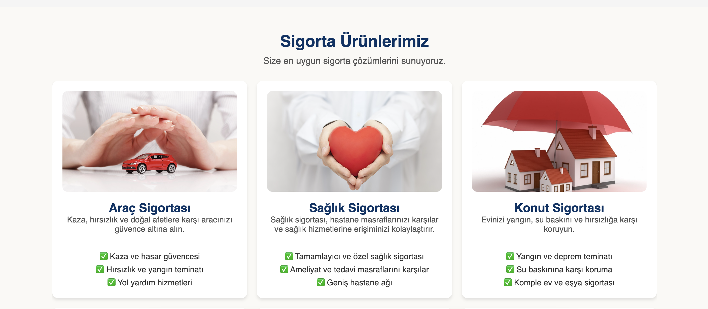

# 🚀 Sigorta Acentesi Web Uygulaması

Sigorta Acentesi Web Uygulaması, kullanıcıların sigorta teklifleri almasını, ürünleri incelemesini ve anlaşmalı kurumlar hakkında bilgi edinmesini sağlayan modern bir **React.js** uygulamasıdır. **Performans optimizasyonu, mobil uyumluluk ve SEO uyumluluğu** sağlanmıştır.

## 🔥 Proje Özellikleri
✅ **React.js & React Router** ile çok sayfalı yapı  
✅ **Performans Optimizasyonu** (Lazy Loading, Memoization)  
✅ **Mobil Uyumlu & Responsive Tasarım**  
✅ **Sigorta Teklif Formu** (Validasyonlu)  
✅ **Dinamik Ürün ve Anlaşmalı Kurumlar Listesi**  
✅ **Hızlı Sayfa Yükleme & SEO Uyumu**  
✅ **Gelişmiş Navbar & Footer Yapısı**  

---

## 📸 **Proje Ekran Görüntüleri**

### 🎯 **Ana Sayfa**

### 📌 **Ürünler Sayfası**

### 🏥 **Anlaşmalı Kurumlar**

